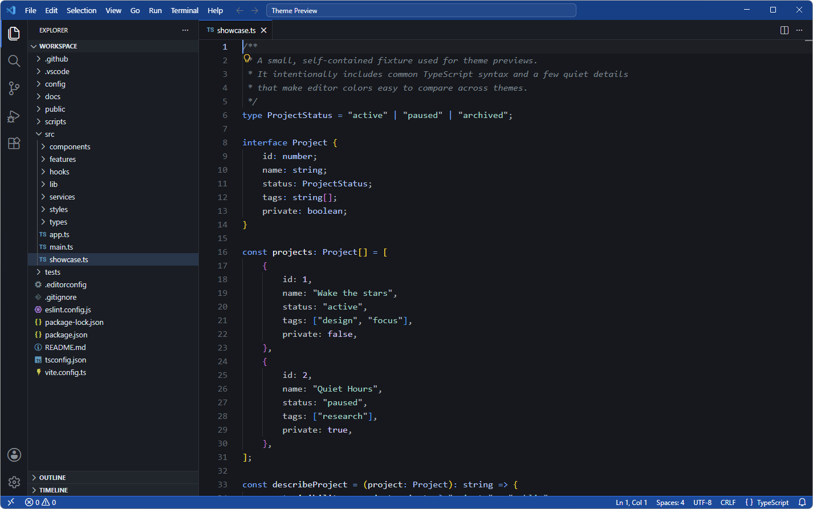
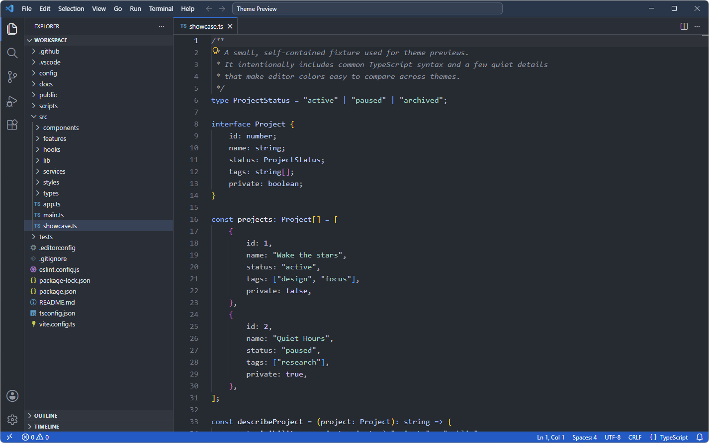
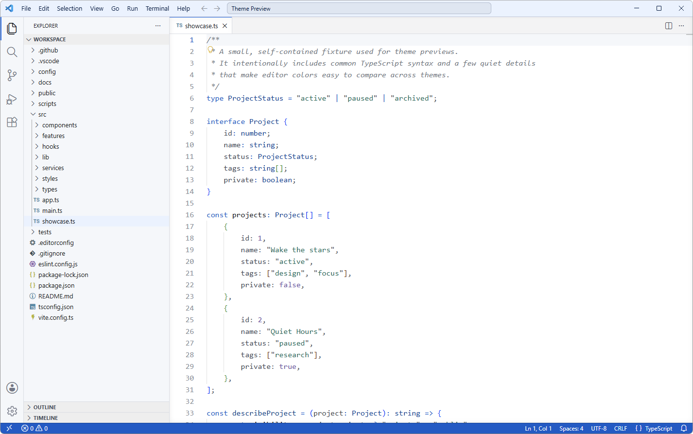
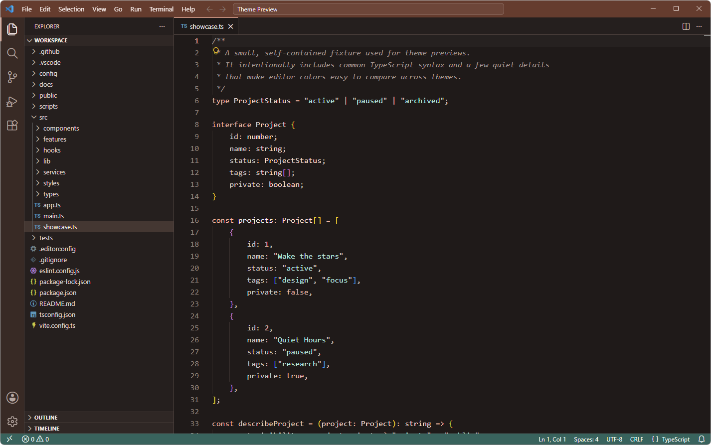
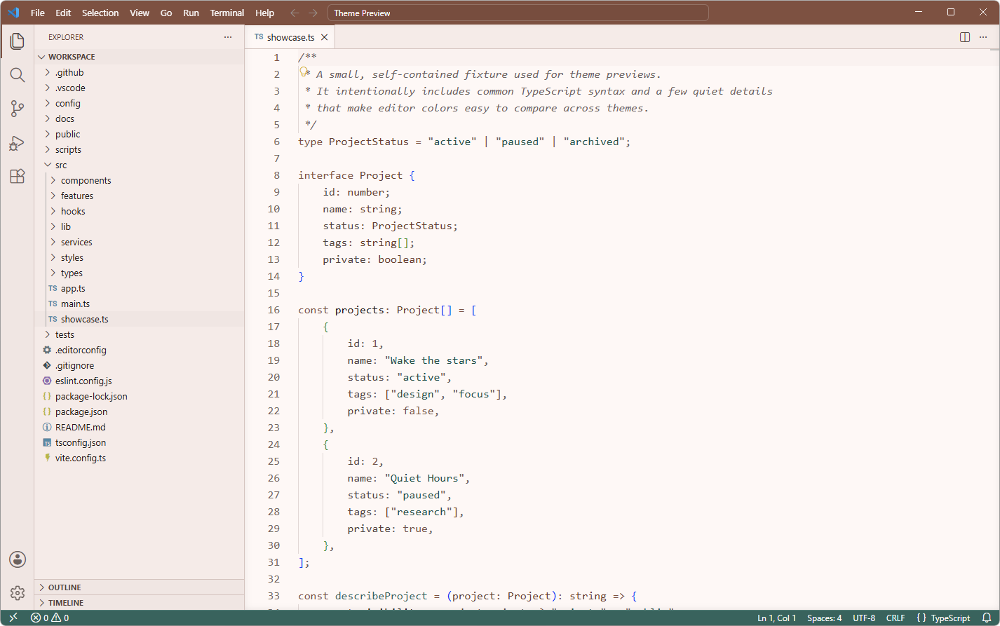
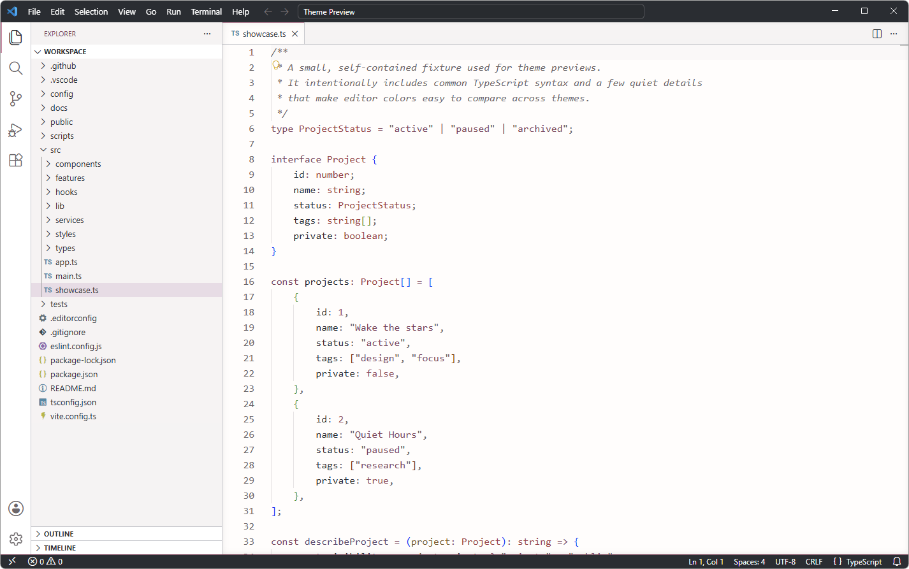
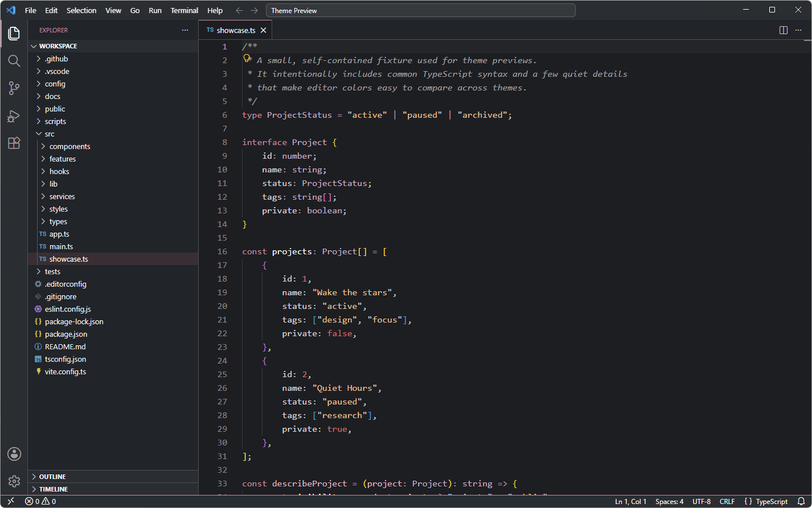

# VS Code Themes

A collection of custom Visual Studio Code themes by Xiomesh.

## Available theme families

### Blueprint Themes

A precise, modern theme family built around restrained color, clear hierarchy, and comfortable contrast.

#### Blueprint Carbon

A dark theme featuring carbon-black surfaces, titanium-gray structure, and deliberate blue accents.

#### Blueprint Graphite

A soft-dark theme featuring graphite surfaces, balanced contrast, and restrained blue accents.

#### Blueprint Paper

A light theme featuring paper-white surfaces, carbon text, titanium-gray structure, and restrained blue accents.

[\[View Blueprint Themes ►\]](extensions/blueprint)

### Mindful Themes

A calming theme family built around warm surfaces, gentle contrast, and emotionally comfortable color.

#### Mindful Curiosity

A warm dark theme featuring soft charcoal surfaces, muted terracotta accents, and calming teal details.

#### Mindful Insight

A gentle light theme featuring warm paper surfaces, grounded brown text, and restrained therapeutic accents.

[\[View Mindful Themes ►\]](extensions/mindful)

### Mauve Method Themes

A thoughtful theme family built around mauve tones and focused contrast.

#### Mauve Method Mist

A light theme built around soft mauve surfaces and focused contrast.

#### Mauve Method Smoke

A dark theme built around deep mauve surfaces and restrained contrast.

[\[View Mauve Method Themes ►\]](extensions/mauve-method)

## Theme features

Each theme includes:

- Workbench and editor colors
- TextMate syntax highlighting
- Semantic-token highlighting
- Custom terminal colors
- Git status colors

## Installation

1. Download the desired `.vsix` file from the repository’s Releases page.
2. Open Visual Studio Code.
3. Open the Command Palette.
4. Run **Extensions: Install from VSIX...**
5. Select the downloaded file.
6. Run **Preferences: Color Theme**.
7. Select the theme you'd like to apply.

## License

Each extension contains its own license information.
